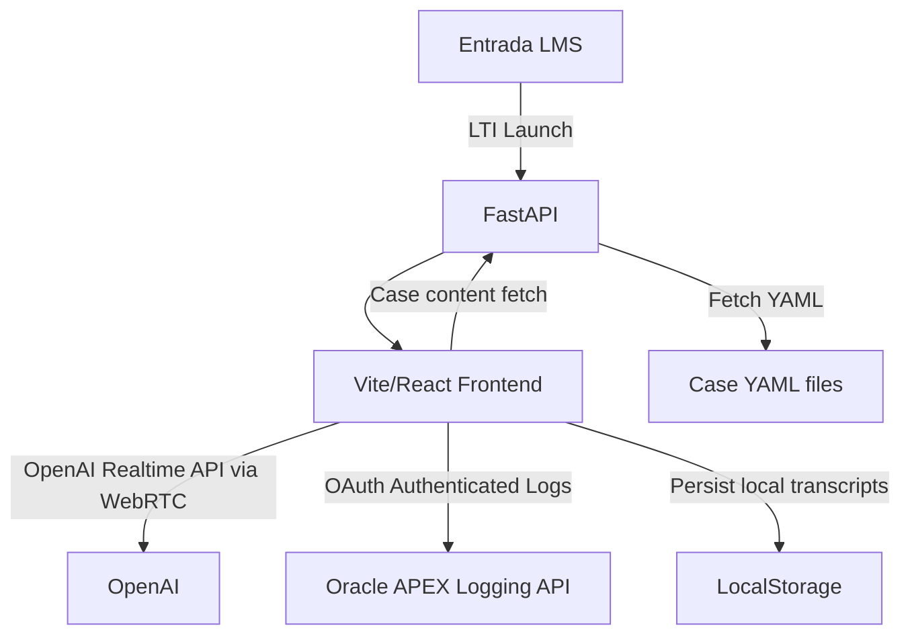

# 🏗️ **PatientLab Application Architecture**

This guide provides clear structure and modularity for your application, making it maintainable, extendable, and easy to understand.

---

## 📌 **Frontend Architecture**

### **Project Structure**

```
frontend/
├── public/
├── src/
│   ├── main.tsx
│   ├── App.tsx
│   ├── routes/
│   │   ├── SpeakPage.tsx
│   │   └── WritePage.tsx
│   ├── components/
│   │   ├── Avatar/
│   │   ├── AgentSwitcher/
│   │   ├── MicActivityIndicator/
│   │   ├── TurnIndicator/
│   │   ├── TranscriptExporter/
│   │   ├── SettingsPanel/
│   │   ├── DDxWizard/
│   │   ├── FeedbackScreen/
│   │   └── ErrorHandler/
│   ├── machines/
│   │   ├── appMachine.ts
│   │   ├── agentMachine.ts
│   │   ├── audioMachine.ts
│   │   └── connectionMachine.ts
│   ├── api/
│   │   ├── openaiApi.ts
│   │   └── apexLogger.ts
│   ├── types/
│   └── utils/
│       └── storage.ts
├── vite.config.ts
├── tsconfig.json
└── package.json
```

### **Core Technologies:**

* **Frameworks:** React, Vite, TypeScript
* **UI:** Tailwind CSS, ShadCN, Framer Motion
* **State Management:** XState v5
* **Realtime Audio:** WebRTC + OpenAI Realtime API

### **State Management with XState:**

* **appMachine**: Global app states (ready, error handling, restarts)
* **agentMachine**: Agent selection, switching, and conversation state
* **audioMachine**: Mic activation, mode (speak/write), push-to-talk handling
* **connectionMachine**: WebRTC lifecycle, retries, error states, reconnection logic

---

## 📁 **Backend Architecture**

### **Project Structure**

```
backend/
├── app/
│   ├── main.py
│   ├── routes/
│   │   ├── lti.py
│   │   ├── openai.py
│   │   ├── cases.py
│   │   └── logging.py
│   ├── schemas/
│   │   ├── case.py
│   │   └── feedback.py
│   ├── services/
│   │   ├── openai_service.py
│   │   └── apex_logger.py
│   └── config.py
├── cases/
│   └── example_case.yaml
├── .env
├── requirements.txt
└── scripts/
    ├── dev.sh
    └── deploy.sh
```

### **Core Technologies:**

* **Framework:** FastAPI, Python, uv
* **Server:** Uvicorn (dev), Gunicorn + UvicornWorker (production)
* **Authentication:** ims-lti-py (Basic LTI 1.1), OAuth 2.0 (APEX logging)
* **API Integrations:** OpenAI API, Oracle APEX REST endpoints

---

## 🎚️ **Application Data Flow**



---

## 🎙️ **Audio and Conversation Lifecycle**

* **Speech Mode**

  * User → WebRTC (mic) → OpenAI Realtime API → Audio response via WebRTC

* **Write Mode**

  * User → Text input → OpenAI API (text mode) → Text response

* **Conversation Context**

  * Managed via `agentMachine`, persisted in LocalStorage.

---

## 🧑‍⚕️ **DDx Wizard Workflow**

* **Activation:** After 4 patient questions
* **Interaction:** DDx Agent (OpenAI assistant) helps users fill diagnosis fields.
* **Submission:** Saves locally, triggers feedback generation.

---

## ✅ **Feedback Generation Workflow**

* User completes DDx → Frontend sends complete transcript → Backend (`openai_service`)
* Backend evaluates transcript using rubric from YAML → OpenAI reasoning call
* Response includes rubric categories, 5-star scores, commentary
* Frontend displays structured, rubric-aligned feedback clearly to user

---

## 📊 **Logging and Analytics**

* **Event Logging**: User interactions and messages logged to Oracle APEX via REST API (OAuth).
* **Error Logging**: Backend errors logged directly to the server file system.

---

## 🛠️ **Deployment Workflow**

* Deploy via bash scripts (`deploy.sh`):

  ```bash
  rsync -avz frontend/dist/ user@rhel-server:/var/www/patientlab/
  rsync -avz backend/ user@rhel-server:/opt/patientlab/
  ssh user@rhel-server 'systemctl restart patientlab'
  ```
* Secrets and API keys maintained in manually-managed `.env` file on server.

---

## ♿ **Accessibility**

* UI components from ShadCN (Radix primitives) to achieve WCAG AA compliance.

---

## ⚠️ **Error Handling**

* **Frontend Errors**

  * Graceful user feedback, retry button available for reconnection.
  * State machines (`connectionMachine`) handle auto-retry logic with exponential back-off.

* **Backend Errors**

  * Error handling middleware in FastAPI to log critical issues.

---

## 🎬 **Animation and UX**

* Animated transitions and mic-activity indicators using Framer Motion.
* Clear visual turn indicators beneath active speaker avatars.

---

## 📝 **Transcript Management**

* Locally persisted transcripts (`localStorage`)
* Single-click export (`.txt`) available at session end or anytime during interaction.

---

## 🔒 **Security & Privacy**

* OAuth-secured logging endpoints
* LTI-based user authentication via Entrada LMS
* No sensitive keys in code, kept manually in `.env`

---

## 🧪 **Development Practices**

* Frontend: TypeScript, ESLint/Prettier formatting
* Backend: Clear FastAPI routes, manual testing
* YAML-based cases: Clearly structured schemas for extensibility

---

### ✅ **Next Steps**

* Scaffold frontend and backend structures based on above architecture.
* Start with core machines (audio, agent, connection).
* Gradually build and integrate components: agent switcher, DDx wizard, feedback screen, logging.
